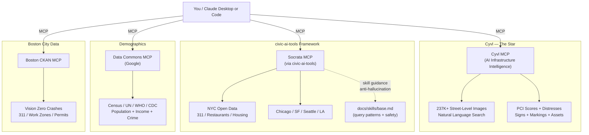

# Infrastructure Intelligence — AI-Powered Civic Data with MCP

See your city's infrastructure through AI. Cyvl searches 237K+ street-level images by natural language — finding fire hydrants, cracked sidewalks, faded crosswalks, and road damage that no database tracks. Combine that with open data from any Socrata-powered city portal and Google Data Commons demographics to answer questions no single dataset can.

## Why This Matters

- **Find infrastructure issues not in any database** — zero-shot visual search across street-level imagery
- **Join city data sources that have never been connected** — crashes + pavement + complaints in one query
- **Generate stakeholder-ready reports in minutes, not days**
- **Works for any city** — Cyvl covers multiple cities; Socrata powers 50+ open data portals

## The MCP Stack

| MCP Server | Role | What It Provides |
|------------|------|-----------------|
| **Cyvl** | AI vision (the star) | Street-level imagery search, pavement scores, signs, markings, distresses |
| **Socrata** | Operational open data | 311 complaints, permits, restaurant inspections, housing — any Socrata portal |
| **Data Commons** | Demographics | Census, population, income, employment — normalized across all US cities |
| **Boston CKAN** | Boston-specific | Vision Zero crashes, active work zones, 311 requests from data.boston.gov |

## Available Skills

| Skill | What It Does |
|-------|-------------|
| `/search-imagery` | Search street-level photos by natural language — the "wow moment" |
| `/explore-dataset` | Browse and query open data from any connected portal |
| `/crash-analysis` | Cross-MCP crash + pavement correlation |
| `/infrastructure-report` | Analyze conditions for a specific area |
| `/sidewalk-audit` | Inventory sidewalks/curbs from imagery |
| `/generate-report` | Generate PDF/HTML reports from infrastructure data |

## How It Works



## Prerequisites

For complete setup instructions including API key registration, Windows PowerShell setup, and troubleshooting, see **[SETUP.md](SETUP.md)**.

**Required:**
- **Claude account**: Pro, Max, Teams, or Enterprise
- **Cyvl account**: Required for infrastructure data and imagery (ask your team for access)
- **Node.js 18+**: Needed for MCP connections (`npx mcp-remote`)
  Install from [nodejs.org](https://nodejs.org/) or via `brew install node` (macOS) / `winget install OpenJS.NodeJS` (Windows)

**Optional (for PDF report generation):**
- **Google Chrome or Chromium** — used for HTML-to-PDF conversion via headless mode. Most systems already have this.

Without Chrome, the `/generate-report` skill generates HTML that you can open in any browser and print to PDF manually.

## Quick Start — Claude Desktop (Cowork)

### 1. Install Claude Desktop

Download from [claude.ai/download](https://claude.ai/download) for macOS or Windows and sign in.

### 2. Clone this repo

```bash
git clone https://github.com/roadgnar/mcp-demo.git
```

### 3. Open the repo in Cowork

1. Open Claude Desktop
2. Click the **Cowork** tab (bottom-left)
3. Click **"Select folder"** and choose the `mcp-demo` folder
4. Cowork opens a session — `CLAUDE.md` and `.mcp.json` are picked up automatically

### 4. Connect the Cyvl MCP

Open data MCPs auto-connect via `.mcp.json` — no action needed.

For Cyvl:
1. In Cowork, open the **MCP connectors** panel (plug icon)
2. Search for **"Cyvl"** and click **Connect**
3. Log in with your Cyvl account and authorize access

### 5. Start exploring

```
Search for "fire hydrants" and show me 3 images
```

Type `/` to see all available skills.

---

## Alternate Setup — Claude Code (Terminal)

### Install Claude Code

**macOS (13.0+):**
```bash
curl -fsSL https://claude.ai/install.sh | bash
```

**Linux (Ubuntu 20.04+ / Debian 10+):**
```bash
curl -fsSL https://claude.ai/install.sh | bash
```

**Windows (10 1809+):**
```powershell
irm https://claude.ai/install.ps1 | iex
```

**Verify:** `claude --version`

### Quick Start (Claude Code)

```bash
git clone https://github.com/roadgnar/mcp-demo.git
cd mcp-demo
claude

# Connect Cyvl (one-time):
/mcp
# Click "Cyvl" -> log in -> authenticate
```

Open data MCPs auto-connect via `.mcp.json`. Once all servers show connected:

```
Search for "fire hydrants" and show me 3 images
```

---

## City Branches

You are on the **nyc** branch. This adds NYC-specific demos, datasets, and prompts on top of the base framework.

**Recommended: Run through [EXAMPLES-NYC.md](EXAMPLES-NYC.md) to verify your setup and see what's possible.** The examples test each MCP connection and demonstrate the full workflow — from Queens street imagery to community board reports.

| Branch | What It Adds |
|--------|-------------|
| **`nyc` (you are here)** | Queens Cyvl imagery, NYC 311, restaurant inspections, housing violations |
| `boston` | Boston neighborhoods, Vision Zero, 311 potholes, Somerville |
| `main` | City-agnostic framework — works for any city |

To switch branches:
```bash
git checkout boston   # Boston demos
git checkout main    # City-agnostic base
```

## What's In This Repo

| File | Purpose |
|------|---------|
| `CLAUDE.md` | Tool guide for all MCPs — auto-loaded every session |
| `.mcp.json` | MCP server connections — auto-loaded |
| `.claude/settings.json` | Pre-approved tool permissions |
| `.claude/skills/` | Reusable workflows invoked via `/` commands |
| `EXAMPLES.md` | Hands-on demo prompts with expected results |
| `prompts/` | Prompt recipes organized by use case |
| `reference/` | Tool docs, dataset schemas, spatial filter examples |

## Extending This Repo

### Add a new MCP server

Edit `.mcp.json`:
```json
{
  "mcpServers": {
    "your-server": {
      "command": "npx",
      "args": ["mcp-remote", "https://your-server-url/sse"]
    }
  }
}
```

### Create a custom skill

1. Create a folder in `.claude/skills/` (e.g., `.claude/skills/my-skill/`)
2. Add a `SKILL.md` describing the workflow
3. Invoke with `/my-skill` in Claude Desktop or Claude Code

## Example Prompts

```
Search for "cracked sidewalks" and show me the worst 5 images
```

```
What are the most dangerous intersections in this city?
```

```
Compare pavement conditions between two neighborhoods
```

```
Make me a report about road conditions on Main Street with street-level photos
```

See `prompts/` for more organized by use case.

## Troubleshooting

| Problem | Fix |
|---------|-----|
| Cyvl MCP not connected (Cowork) | Open MCP connectors panel, search for Cyvl, complete OAuth |
| Cyvl MCP not connected (Claude Code) | Run `/mcp`, click Cyvl, complete OAuth |
| Open data MCP not connected | Check `.mcp.json` is present. Install Node.js 18+ from [nodejs.org](https://nodejs.org/). |
| 502 Bad Gateway on Cyvl | Retry once — transient proxy errors resolve immediately |
| `list_distresses` times out | Reduce radius to 100m, or use `search_imagery` instead |
| SQL column name error | Column names are case-sensitive. Always check schema first. |

## Civic AI Tools

This repo integrates [**civic-ai-tools**](https://github.com/npstorey/civic-ai-tools) by **Nick Storey ([@npstorey](https://github.com/npstorey))** as a git subtree in `civic-ai-tools/`. civic-ai-tools is the open-source framework that makes AI + civic open data reliable:

- **Anti-hallucination skill guidance** — rules enforced by the Socrata MCP server via `prompts/get` to prevent fabricated data, enforce column discovery, and gate query complexity
- **Curated dataset directories** — verified dataset IDs across NYC, Chicago, SF, Seattle, and LA (`civic-ai-tools/docs/datasets.md`)
- **50+ MCP server registry** — directory of civic data MCP servers worldwide (`civic-ai-tools/docs/mcp-servers.md`)
- **SoQL query patterns** — case-sensitivity rules, date handling, spatial filters, error recovery (`civic-ai-tools/docs/skills/base.md`)
- **Multi-IDE setup automation** — config generation for Claude Code, Cursor, VS Code, Codex, and GitHub Codespaces

The **Socrata MCP server** (by **Scott Robbin**, [socrata-mcp-server](https://github.com/npstorey/socrata-mcp-server)) powers all Socrata portal queries via `npx socrata-mcp-server --stdio`. It delivers the civic-ai-tools skill guidance automatically through the MCP protocol.

To update civic-ai-tools to latest:
```bash
git subtree pull --prefix=civic-ai-tools https://github.com/npstorey/civic-ai-tools.git main --squash
```

## Resources

**Tools:**
- [Cyvl](https://i3.cyvl.dev/docs) — AI infrastructure intelligence (street imagery + pavement + signs)
- [civic-ai-tools](https://github.com/npstorey/civic-ai-tools) — Open-source framework by Nick Storey ([@npstorey](https://github.com/npstorey))
- [socrata-mcp-server](https://github.com/npstorey/socrata-mcp-server) — Socrata MCP by Scott Robbin
- [Data Commons](https://datacommons.org) — Google's unified statistical knowledge graph

**Data Portals:**
- [NYC Open Data](https://data.cityofnewyork.us) — Socrata-powered, 2,000+ datasets
- [Boston Open Data](https://data.boston.gov) — CKAN-powered, Analyze Boston
- [Chicago Open Data](https://data.cityofchicago.org) | [SF Open Data](https://data.sfgov.org) | [Seattle Open Data](https://data.seattle.gov)

**Claude:**
- [Claude Desktop](https://claude.ai/download) | [Claude Code](https://code.claude.com/docs/en/setup) | [MCP Best Practices](https://www.anthropic.com/engineering/writing-tools-for-agents)
