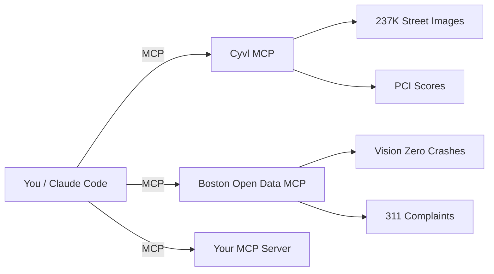

# MCP Demo — Boston Infrastructure Intelligence

Answer any question about your city's infrastructure — find safety hazards invisible to existing databases, generate reports backed by street-level evidence, build prioritized repair lists that combine crash data with pavement conditions. Powered by two MCP-connected data sources: Cyvl (AI infrastructure intelligence) and Boston Open Data (city records).

## Why This Matters

- **Find infrastructure issues not in any database** — zero-shot visual search across street-level imagery
- **Join city data sources that have never been connected** — crashes + pavement + complaints in one query
- **Generate stakeholder-ready reports in minutes, not days**
- **Build custom tools on demand** — compliance checkers, repair prioritizers, field survey apps

## Prerequisites

**Required:**
- **Claude account**: Pro, Max, Teams, or Enterprise (free plan does not include Claude Code)
- **Claude Code**: Installed and authenticated (see [Install Claude Code](#install-claude-code) below)
- **Cyvl account**: Required for infrastructure data and imagery (ask your team for access)
- **Node.js 18+**: Needed for the Boston Open Data MCP connection (`npx mcp-remote`)
  Install from [nodejs.org](https://nodejs.org/) or via `brew install node` (macOS) / `winget install OpenJS.NodeJS` (Windows)

**Optional (for PDF report generation):**
- **Google Chrome or Chromium** — used for HTML-to-PDF conversion via headless mode. Most systems already have this. If not:
  - macOS: `brew install --cask google-chrome`
  - Linux: `sudo apt install google-chrome-stable`
  - Windows: Install from [google.com/chrome](https://www.google.com/chrome/)

Without Chrome, the `/generate-report` skill generates HTML that you can open in any browser and print to PDF manually.

## Install Claude Code

### macOS (13.0+)

```bash
# Recommended (auto-updates)
curl -fsSL https://claude.ai/install.sh | bash

# Or via Homebrew (manual updates)
brew install --cask claude-code
```

### Linux (Ubuntu 20.04+ / Debian 10+)

```bash
curl -fsSL https://claude.ai/install.sh | bash
```

### Windows (10 1809+)

**Prerequisite:** Install [Git for Windows](https://git-scm.com/downloads/win) first.

```powershell
# PowerShell
irm https://claude.ai/install.ps1 | iex

# Or via WinGet
winget install Anthropic.ClaudeCode
```

### WSL

Install inside your WSL distro using the Linux command above.

### Verify

```bash
claude --version
```

### First-time authentication

Run `claude` — a browser window opens for OAuth login. Log in with your Claude account.

## Quick Start

```bash
# 1. Clone the repo
git clone https://github.com/roadgnar/mcp-demo.git
cd mcp-demo

# 2. Open Claude Code
claude

# 3. Connect the Cyvl MCP (one-time)
/mcp
# Click "Cyvl" → log in with your Cyvl account when the browser opens → authenticate
```

The **Boston Open Data MCP** auto-connects via `.mcp.json` — no auth needed (public data).

Once both servers show as connected, you're ready:

```
Search for "fire hydrants" in Boston and show me 3 images
```

## What's In This Repo

| File | Purpose | When It's Used |
|------|---------|---------------|
| `CLAUDE.md` | General-purpose tool guide — describes both MCPs, datasets, SQL gotchas, spatial queries, error handling | Auto-loaded every session |
| `.mcp.json` | Connects the Boston Open Data MCP automatically | Auto-loaded every session |
| `.claude/settings.json` | Pre-approves MCP tool permissions (no popups) | Auto-loaded every session |
| `.claude/skills/` | 6 reusable workflows invoked via `/` commands | On demand |
| `FOLLOW-ALONG.md` | Step-by-step demo walkthrough with copy-paste prompts and expected results | Read when running the demo |
| `prompts/` | Prompt recipe collections organized by use case | Reference |
| `reference/` | Tool docs, dataset schemas, spatial filter examples, neighborhood coordinates | Reference |

### The separation

- **`CLAUDE.md`** teaches Claude how to use the tools. It's general-purpose — works for any infrastructure question, not just the demo script.
- **`FOLLOW-ALONG.md`** is the demo walkthrough. It has specific prompts, expected result counts, and notes about what to look for. Follow it step by step.
- **Skills** are reusable workflows. Type `/` in Claude Code to see them.

## Available Skills

| Skill | What It Does |
|-------|-------------|
| `/search-imagery` | Search street-level photos by natural language |
| `/crash-analysis` | Cross-MCP crash + pavement correlation |
| `/sidewalk-audit` | Inventory sidewalks/curbs from imagery |
| `/infrastructure-report` | Generate stakeholder-ready reports |
| `/explore-dataset` | Browse and query Boston open data |
| `/generate-report` | Generate PDF report/slides from infrastructure data |

## How It Works



## Running the Demo

Open `FOLLOW-ALONG.md` and work through it section by section. Each part has:
- A prompt you can copy-paste into Claude Code
- Expected results so you know what to look for
- Notes on what makes the result interesting

The demo covers:
1. **Imagery Search** — find fire hydrants, crosswalk markings, construction sites, dogs
2. **Pavement Conditions** — worst streets downtown, distress details
3. **Crash Records** — most dangerous streets, mode breakdowns
4. **Cross-MCP Analysis** — crashes + pavement together
5. **Sidewalk Data Gap** — no condition data exists; imagery fills it
6. **Deliverable Generation** — turn analysis into a report

### Pre-demo warmup

The first Cyvl MCP call in a session can take 5-10 seconds (cold start). Run one search before presenting:

```
Search for "fire hydrants" in the Boston project. How many did you find?
```

Subsequent calls are fast.

## Extending This Repo

### Add a new MCP server

Edit `.mcp.json` to add another data source. The format is:

```json
{
  "mcpServers": {
    "your-server-name": {
      "command": "npx",
      "args": ["mcp-remote", "https://your-server-url/sse"]
    }
  }
}
```

For example, to add Cambridge open data:

```json
{
  "cambridge": {
    "command": "npx",
    "args": ["mcp-remote", "https://data.cambridgema.gov/mcp/sse"]
  }
}
```

### Use a different city's Cyvl project

The Boston project ID is hardcoded in `CLAUDE.md`. To switch to a different city:

1. Run `list_projects` in Claude Code to discover available projects
2. Find the project ID for your city
3. Update the project ID in `CLAUDE.md`

### Create a custom skill

1. Create a new folder in `.claude/skills/` (e.g., `.claude/skills/my-skill/`)
2. Add a `SKILL.md` file describing what the skill does, its inputs, and step-by-step instructions
3. Claude Code will pick it up automatically — invoke it with `/my-skill`

### MCP beyond Claude Code

MCP is a protocol — any AI client that supports the Model Context Protocol can connect to these servers, not just Claude Code. If your team uses other MCP-compatible tools, they can use the same `.mcp.json` configuration.

## Example Prompts

Beyond the demo script, try anything:

```
What are the most dangerous intersections in Boston?
```

```
Does Boston have a sidewalk condition dataset? If not, find cracked sidewalks from imagery.
```

```
Compare construction activity between South End and Dorchester.
```

```
Make me a report about pavement conditions on Washington Street with street-level photos.
```

See `prompts/` for more organized by use case.

## Troubleshooting

| Problem | Fix |
|---------|-----|
| Cyvl MCP not connected | Run `/mcp` inside Claude Code, click Cyvl, complete OAuth |
| Boston MCP not connected | Check `.mcp.json` is present. Run `/mcp` to verify. Install Node.js 18+ from [nodejs.org](https://nodejs.org/) — `npx` is included automatically. |
| 502 Bad Gateway on Cyvl call | Retry once — these are transient proxy errors that resolve immediately |
| `list_distresses` times out | Reduce radius to 100m, or use `search_imagery` instead (never times out) |
| SQL column name error | Column names are case-sensitive on some datasets. Always check schema first. |
| No results from 311 pothole query | Use the legacy 311 dataset (`1a0b420d-...`), not the New System one |

## Repo Structure

```
mcp-demo/
├── CLAUDE.md                          # Auto-loaded: tool guide for both MCPs
├── .mcp.json                          # Auto-loaded: Boston Open Data MCP connection
├── .claude/
│   ├── settings.json                  # Auto-loaded: pre-approved permissions
│   └── skills/
│       ├── search-imagery/SKILL.md    # /search-imagery
│       ├── crash-analysis/SKILL.md    # /crash-analysis
│       ├── sidewalk-audit/SKILL.md    # /sidewalk-audit
│       ├── infrastructure-report/SKILL.md
│       ├── explore-dataset/SKILL.md   # /explore-dataset
│       └── generate-report/SKILL.md   # /generate-report
├── FOLLOW-ALONG.md                    # Step-by-step demo walkthrough
├── prompts/                           # Prompt recipe collections
│   ├── imagery-search.md
│   ├── cross-mcp-analysis.md
│   ├── sidewalk-curb.md
│   ├── construction.md
│   └── deliverables.md
└── reference/                         # Quick-reference docs
    ├── cyvl-mcp-tools.md
    ├── boston-datasets.md
    └── spatial-filters.md
```

## Resources

- [Claude Code Setup Guide](https://code.claude.com/docs/en/setup)
- [Claude Code MCP Docs](https://code.claude.com/docs/en/mcp)
- [Cyvl MCP Documentation](https://i3.cyvl.dev/docs)
- [Boston Open Data Portal](https://data.boston.gov)
- [MCP Best Practices (Anthropic)](https://www.anthropic.com/engineering/writing-tools-for-agents)
